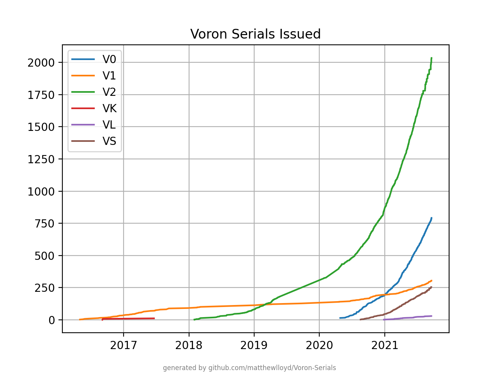
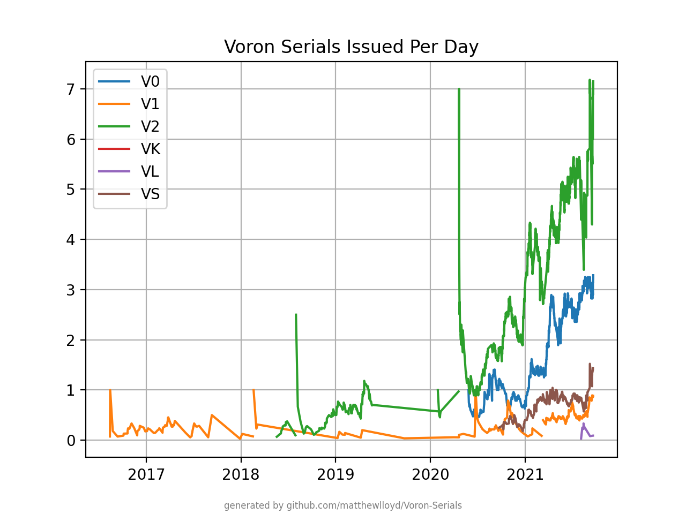

# Voron Serial Predictor

_Note: due to recent events, various technical shortcomings with Voron printers,
and inappropriate and irrational actions taken by the Voron team against a
substantial number of dissenting community members expressing their right to
free speech, including myself, I no longer recommend building printers of their
design. I will be publishing a detailed article explaining why in the near future, which I will link to here._

This is a set of small Python scripts which:

* Fetches all issued Voron serials from [r/voroncorexy](https://www.reddit.com/r/voroncorexy/)
  sidebars and from the [voron_registry_bot](https://www.reddit.com/user/voron_registry_bot/).
* Fetches a list of posts to the Reddit made since the most recently granted
  serial, and predicts the next serial numbers to be issued.
  This can be used to time posting to claim a specific serial number.
* Plots a chart of issued serial numbers over time.

### Warning

I do not recommend attempting to snag serial numbers that are likely
to be in high demand, for example V2.2222. While it is relatively easy to time
posting of your serial video, the serial granting process is not really public:

* The Voron team manages the serial registry and occasionally secretly withholds
  specific serial numbers for their own. For example, they have used their own
  serial management backend, which tracks serial candidates and potential numbers,
  to issue alerts to the team when candidates are posted for certain numbers. 
  Since they control the entire process, including the
  timing of the batches in which the serials are issued, they have an "unfair
  home advantage", and there is no way to know what they have planned since they
  do not announce it beforehand.
  They are the sole arbiters of which requests get accepted, and which get rejected.
* Posts which get marked as spam by Reddit's spam filters are not visible to
  the public, yet are visible to the Voron team and can be taken out of the
  "spam folder" at any time, retaining their original timestamps. This makes
  the rest of the queue move forward by one number.

You have been warned!

## Usage

### Reddit API Authorization

The first step is to get a Reddit API secret and client ID.

* Visit [Reddit's authorized app page](https://www.reddit.com/prefs/apps).
* Scroll to the bottom and click "create another app...". Be sure to choose "script".
* Note down the code below "personal use script", which is your client ID,
  and the code next to "secret".

The authorization codes can then be passed to the scripts with
the options: `--client-id=<asdf> --secret=<qwerty> --user=<your_Reddit_username>`.

### Requirements

You will need Python 3, and to install the required packages using
`pip3 install -r requirements.txt`.

### Fetching Serials

```
python3 fetch_serials.py --client-id=... --secret=... --user=...
```

This will fetch all serials issued, and produces two JSON files,
`reddit_sidebar_serials.json` and `reddit_bot_comments.json`. If the script
is run again, it will pick up from where it left off, assuming it has run
successfully at least once (it can take some time).

### Predicting Serials

```
python3 predict_serials.py --client-id=... --secret=... --user=...
```

This script is currently configured to predict V2 serials, but is easily
modified to work for other models.

This will fetch the post queue, analyzing each post to determine if it is a
V2 serial request. Then it will predict serials issued to each post in the queue.

Note that for this to work correctly, you need to make an educated guess, for
each submission, as to whether the team will grant a serial, or request more
cable management, etc. Update the `rejects` and `rejects_checked_through`
variables in `predict_serials.py` to do this.

### Graphing Serials

```
python3 graphs.py --dpi=600
```

The DPI value adjusts the overall resolution of the generated charts, which will
be written to `graph_issued.png` and `graph_rate.png`.

Here are the charts as of 2021-09-20:



